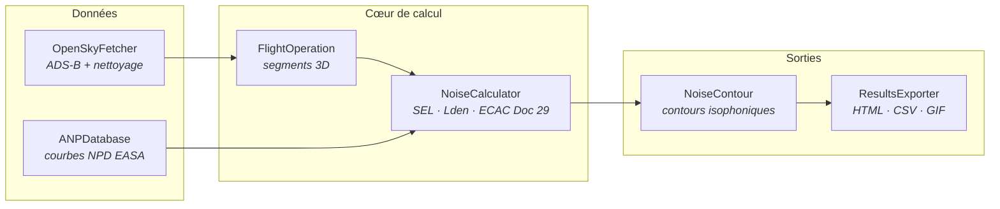

<div align="center">


# ✈️ AirNoisePy

**Modélisation du bruit aérien autour de l'aéroport Montréal-Trudeau (YUL)
selon la norme ECAC Doc 29**

[](https://www.python.org/)
[](LICENSE.md)
[](tests/)
[](app.py)
[](https://www.ecac-ceac.org/)

*Projet de session MGA802 — École de technologie supérieure, Été 2026*
*Équipe 4 : Kevin · Bouchra · Syndia · Laura*

</div>

---

## 🎯 Le projet en une phrase

Pour chaque avion qui décolle ou atterrit à YUL, AirNoisePy calcule le niveau
sonore ressenti au sol par les riverains, en croisant **trois sources de
données indépendantes** :

| Source | Ce qu'elle apporte |
|---|---|
| 🛰️ **OpenSky Network** (ADS-B) | la *géométrie* — trajectoires 3D réelles des vols |
| 📊 **EASA ANP v9** | l'*acoustique* — courbes Noise-Power-Distance certifiées de 14 avions |
| 🎙️ **WebTrak / ADM** | la *validation* — mesures des sonomètres physiques (tolérance ±3 dB) |

Le résultat : des cartes de contours isophoniques **Lden** (l'indicateur
officiel de la directive européenne 2002/49/CE, celui des cartes publiées
par Aéroports de Montréal), calculées sur une grille de 160 000 récepteurs
dans un rayon de 25 km.

---

## 🏗️ Architecture

Six classes, une responsabilité chacune, interfaces définies avant le code :



Le **notebook**, les **142 tests** et la **démo Streamlit** consomment
exactement les mêmes classes — aucune n'a été modifiée pour les besoins de
l'interface. `NoiseCalculator` reçoit sa base NPD par injection de
dépendance : chaque membre a pu développer et tester sa classe
indépendamment des autres.

---

## 🚀 Installation

```bash
git clone https://github.com/kevin-noah/equipe4-airnoisepy-20262.git
cd equipe4-airnoisepy-20262
pip install .
```

## ⚡ Démarrage rapide

```python
from airnoisepy import ANPDatabase, FlightOperation, NoiseCalculator

anp  = ANPDatabase('data/anp/EASA_ANP_database_NPD_Data_v9.xlsx')
calc = NoiseCalculator(anp)

import json
vol = FlightOperation.from_opensky(json.load(open('data/sample_track.json')))
sel = calc.compute_sel(vol, receptor=(45.50, -73.62))   # centre-ville
print(f'{vol.callsign} : SEL {sel:.1f} dB(A)')
```

Sans le fichier Excel EASA, `ANPDatabase()` bascule automatiquement sur une
table synthétique A320 intégrée : **tout fonctionne hors-ligne**, y compris
pour un correcteur qui vient de cloner le dépôt.

L'exemple complet (vol réel → grille Lden → carte interactive → animation
24 h) est dans [`examples/yul_example.ipynb`](examples/yul_example.ipynb).

---

## 🖥️ Démo interactive

```bash
pip install streamlit streamlit-folium
streamlit run app.py
```

| Onglet | Ce qu'il montre |
|---|---|
| 🏠 **Le bruit chez vous** | cliquez n'importe où → Lden + équivalent parlant + verdict réglementaire |
| 🕐 **Journée 24 h** | l'accumulation du bruit heure par heure (566 mouvements, profil horaire réel de YUL) |
| 📡 **Avions en direct** | les avions au-dessus de Montréal *maintenant* + niveau instantané estimé au clic |
| ✅ **Validation WebTrak** | écart modèle/mesure avec la tolérance ECAC ±3 dB |
| 🌙 **Couvre-feu 23h-7h** | scénario *what-if* : les contours se contractent en direct |

---

## 🔬 La physique en bref

- **Les décibels ne s'additionnent pas** : 70 dB + 70 dB = 73 dB. Toutes les
  agrégations passent par l'énergie : `10·log10(Σ 10^(L/10))`.
- **SEL** : énergie totale d'un survol · **Lden** : gêne moyenne sur 24 h,
  pénalisée +5 dB le soir et +10 dB la nuit · **LAmax** : pic instantané.
- **Corrections ECAC Doc 29** : durée (vitesse), latérale (directivité),
  atmosphérique (ISO 9613-1, température + humidité).
- **Interpolation NPD** bilinéaire en poussée × log₁₀(distance) — vectorisée
  numpy : la grille complète se calcule en **0.04 s** (vs 4 min 38 en boucle
  Python : facteur ~7000).

Seuils réglementaires : **55 dB** information des riverains · **65 dB**
isolation acoustique obligatoire.

---

## ✅ Tests

```bash
python -m pytest tests/ -q        # 142 tests
```

Chaque classe a sa suite : mécanique de calcul vérifiée contre des valeurs
analytiques exactes (mock), nettoyage de données, intégration bout-en-bout
avec la vraie base EASA, plausibilité physique (le bruit décroît avec la
distance, croît avec la poussée, départ > arrivée).

---

## 👥 Équipe

| Membre | Classes | Infrastructure |
|---|---|---|
| **Kevin** | `FlightOperation` · `NoiseCalculator` | `app.py` (démo Streamlit) |
| **Bouchra** | `ANPDatabase` | `LICENSE.md` · `Requirements.txt` |
| **Syndia** | `OpenSkyFetcher` · `NoiseContour` | — |
| **Laura** | `ResultsExporter` | `README.md` · `pyproject.toml` |

---

## 📚 Références

- ECAC Doc 29, 4ᵉ éd. — *Report on Standard Method of Computing Noise
  Contours around Civil Airports*
- [EASA Aircraft Noise and Performance (ANP) database v9](https://www.easa.europa.eu/en/domains/environment/policy-support-and-research/aircraft-noise-and-performance-anp-data)
- [OpenSky Network](https://opensky-network.org/) — données ADS-B
- Directive 2002/49/CE — évaluation et gestion du bruit dans l'environnement
- [WebTrak YUL](https://webtrak.emsbk.com/yul) — Aéroports de Montréal
- ISO 9613-1 — atténuation du son lors de sa propagation à l'air libre

## 📄 Licence

Distribué sous licence MIT — voir [`LICENSE.md`](LICENSE.md).

> *Please cite as:* Kevin, Bouchra, Syndia, Laura. **AirNoisePy: a Python
> tool for aircraft noise modelling around Montréal-Trudeau airport
> (ECAC Doc 29)**, MGA802, École de technologie supérieure, Montréal, 2026.

---

<div align="center">

**Construit avec**

&nbsp;&nbsp;&nbsp;&nbsp;
&nbsp;&nbsp;&nbsp;&nbsp;
&nbsp;&nbsp;&nbsp;&nbsp;


<sub>MGA802 — Introduction à la programmation avec Python · ÉTS Montréal · Été 2026</sub>

</div>
